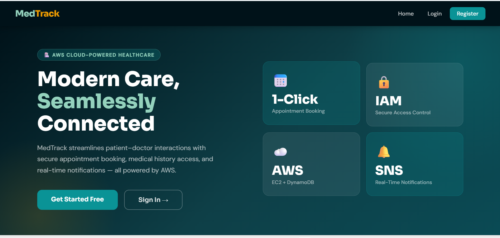
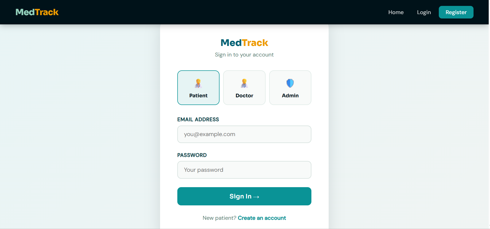
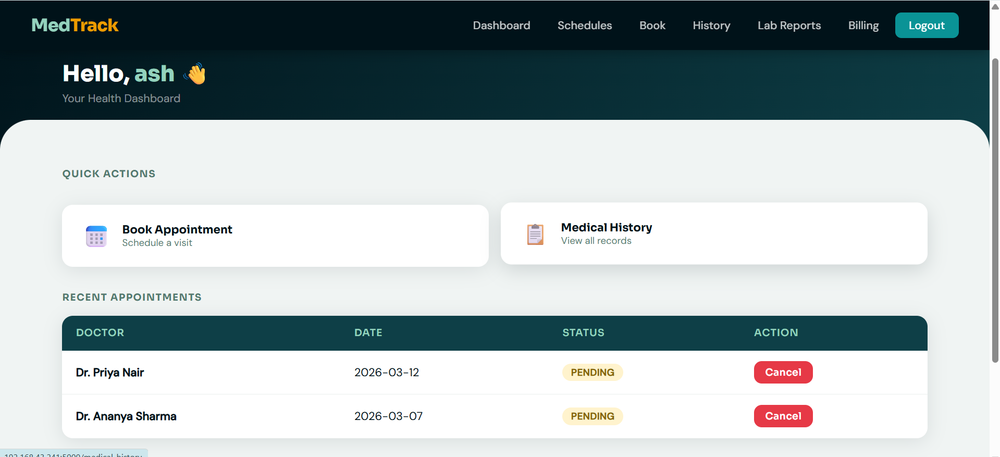
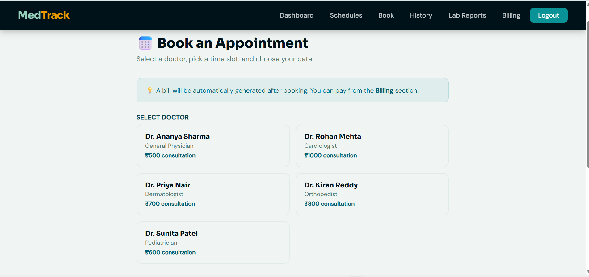
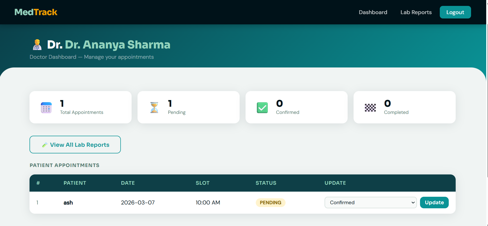
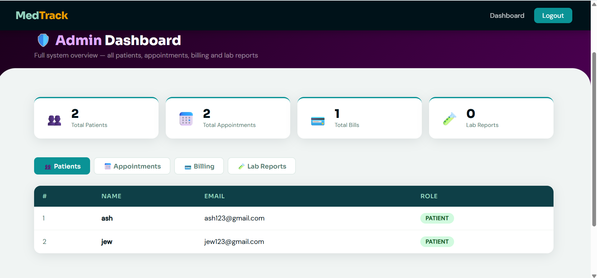
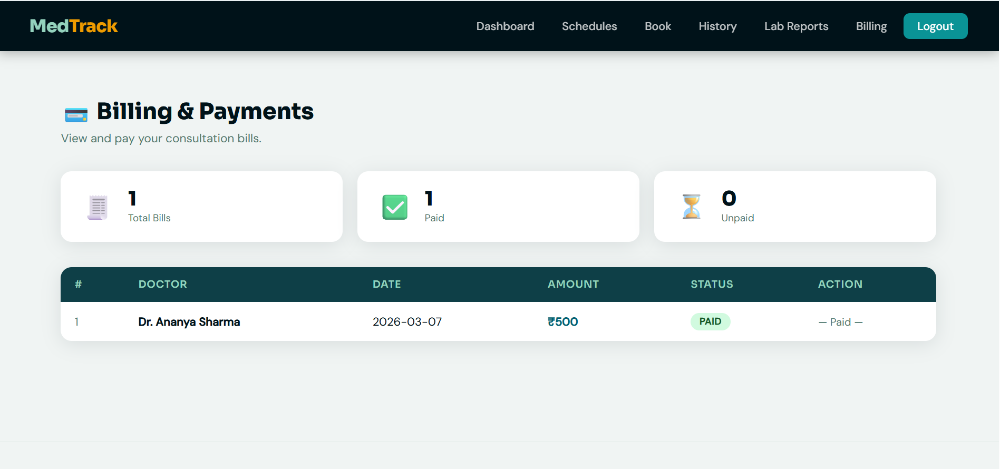

# MedTrack — AWS Cloud-Enabled Healthcare Management System


A cloud-based healthcare management system built with Flask and AWS services that streamlines patient–doctor interactions through secure appointment booking, medical history management, lab report submissions, and real-time notifications.

---

## Features

- Patient Registration & Login
- Doctor Login with Role-Based Access
- Admin Dashboard with full system overview
- Appointment Booking with Doctor & Time Slot Selection
- Doctor Schedule Viewer
- Medical History Tracking
- Lab Report Submission & Viewing
- Billing & Payment Management
- AWS SNS Email Notifications
- IAM Role-Based Access Control

---

## Tech Stack

| Layer | Technology |
|---|---|
| Backend | Python, Flask |
| Database | AWS DynamoDB |
| Notifications | AWS SNS |
| Hosting | AWS EC2 |
| Access Control | AWS IAM |
| Monitoring | AWS CloudWatch |
| Web Server | Gunicorn + Nginx |

---

## AWS Services Used

- **EC2** — Hosts the Flask application
- **DynamoDB** — Stores patients, appointments, billing, lab reports, doctors
- **SNS** — Sends email notifications for bookings, cancellations, payments
- **IAM** — Role-based access control for patients, doctors, and admin
- **CloudWatch** — Monitors logs and performance metrics
- **VPC** — Secure network configuration
- **Route 53** — DNS management

---

## DynamoDB Tables

| Table | Partition Key | Description |
|---|---|---|
| Patients | PatientID (String) | Patient profiles and credentials |
| Appointments | AppointmentID (String) | Booking records |
| Doctors | DoctorID (String) | Doctor profiles and credentials |
| LabReports | ReportID (String) | Patient lab test results |
| Billing | BillID (String) | Consultation bills and payment status |

---

## Project Structure
```
medtrack/
│
├── app.py                     # Main Flask application
├── requirements.txt           # Python dependencies
├── README.md                  # Project documentation
│
├── templates/
│   ├── base.html              # Base layout with navigation
│   ├── index.html             # Landing page
│   ├── login.html             # Unified login with role selection
│   ├── register.html          # Patient registration
│   ├── dashboard.html         # Patient dashboard
│   ├── schedules.html         # Doctor schedules viewer
│   ├── book.html              # Appointment booking
│   ├── history.html           # Medical history
│   ├── lab_reports.html       # Lab report submission & view
│   ├── billing.html           # Billing & payments
│   ├── doctor_dashboard.html  # Doctor dashboard
│   ├── doctor_lab_reports.html# Doctor view of lab reports
│   └── admin_dashboard.html   # Admin overview
│
└── static/
    ├── css/
    ├── js/
    └── images/
```

---

## User Roles

| Role | Access |
|---|---|
| Patient | Register, login, book appointments, view history, submit lab reports, pay bills |
| Doctor | View assigned appointments, update status, view all patient lab reports |
| Admin | View all patients, appointments, bills, and lab reports |

---

## Setup & Run Locally

### 1. Clone the repository
```bash
git clone https://github.com/yourusername/medtrack.git
cd medtrack
```

### 2. Install dependencies
```bash
pip install -r requirements.txt
```

### 3. Configure AWS credentials
```bash
aws configure
# AWS Access Key ID: your key
# AWS Secret Access Key: your secret
# Default region: ap-south-1
# Default output format: json
```

### 4. Run the application
```bash
python app.py
```

### 5. Open in browser
```
http://localhost:5000
```

---

## Test Credentials

| Role | Email | Password |
|---|---|---|
| Doctor | doctor@medtrack.com | 123456 |
| Admin | admin@medtrack.com | admin123 |
| Patient | register a new account | your password |

---

## SNS Notifications

Email notifications are sent automatically for:
- New patient registration
- Appointment booking confirmation
- Appointment cancellation
- Appointment status update by doctor
- Lab report submission
- Payment confirmation

---

## Deployment on AWS EC2

### 1. Launch EC2 Instance
- AMI: Amazon Linux 2 or Ubuntu 22.04
- Instance type: t2.micro
- Security group: Allow HTTP (80), HTTPS (443), SSH (22)

### 2. Install dependencies
```bash
sudo apt update
sudo apt install python3 python3-pip nginx -y
pip3 install -r requirements.txt
```

### 3. Attach IAM Role to EC2
- Create IAM role with these policies:
  - AmazonDynamoDBFullAccess
  - AmazonSNSFullAccess
- Attach role to EC2 instance

### 4. Run with Gunicorn
```bash
gunicorn -w 4 -b 0.0.0.0:8000 app:app
```

### 5. Configure Nginx
```nginx
server {
    listen 80;
    server_name your-domain.com;
    location / {
        proxy_pass http://127.0.0.1:8000;
        proxy_set_header Host $host;
        proxy_set_header X-Real-IP $remote_addr;
    }
}
```

---

## Screenshots
## Screenshots

### Home Page


### Login Page


### Patient Dashboard


### Book Appointment


### Doctor Dashboard


### Admin Dashboard


### Billing


---

## Team

| Name | Role |
|---|---|
| Chinmaygouda Patil | Team Lead |
| Amisha A Kotian | Member |
| Chaaya | Member |
| Malavika Gireesh | Member |
| Ainam Mansia | Member |


## License

This project was built as part of an AWS Cloud internship program.